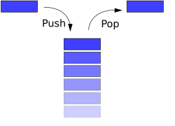
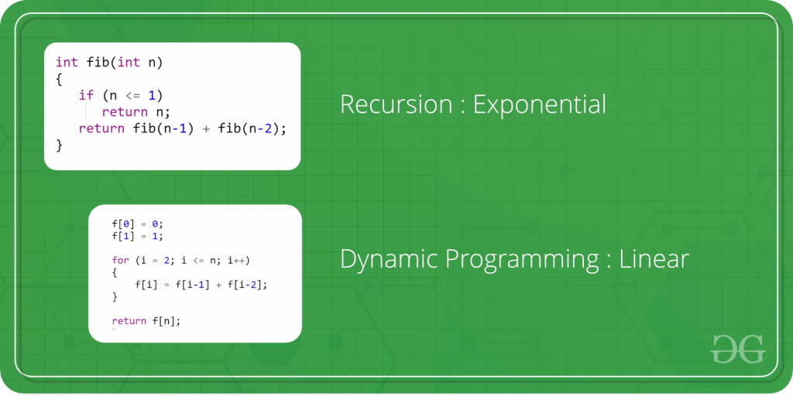
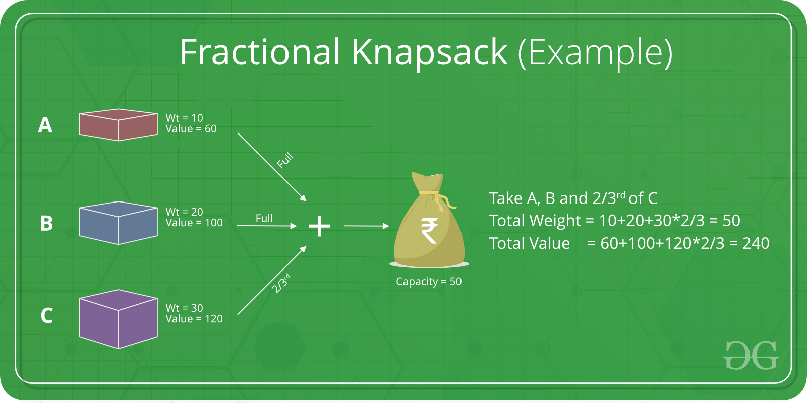
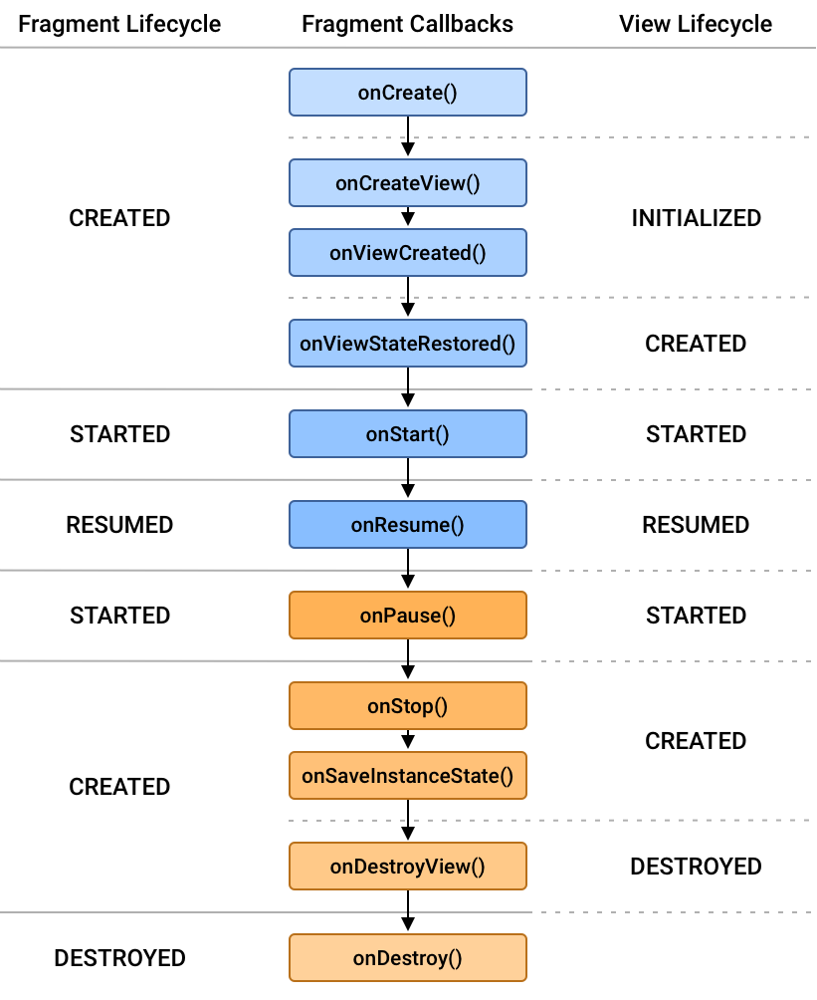
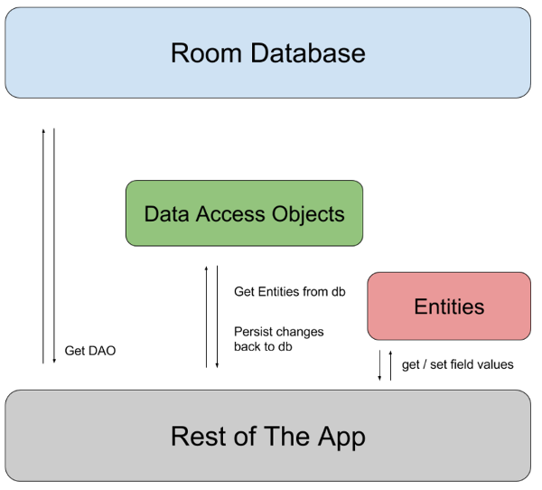
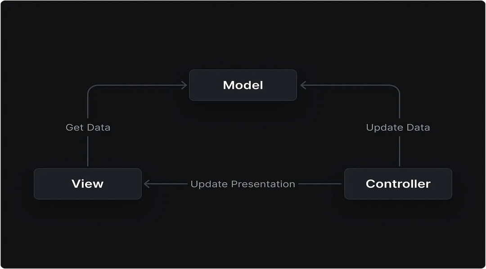
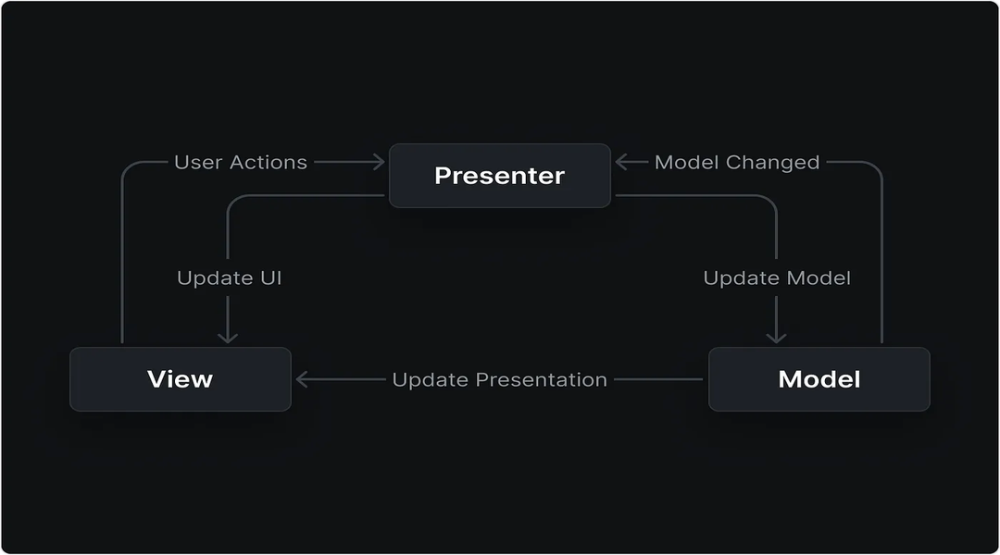
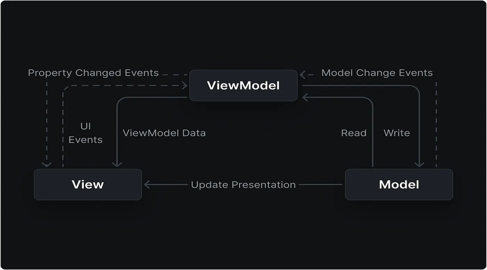
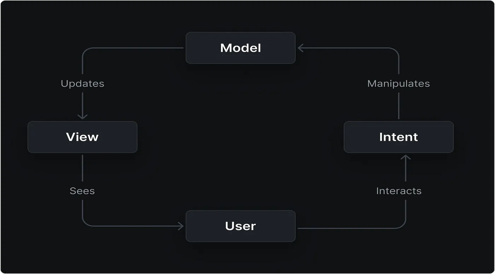
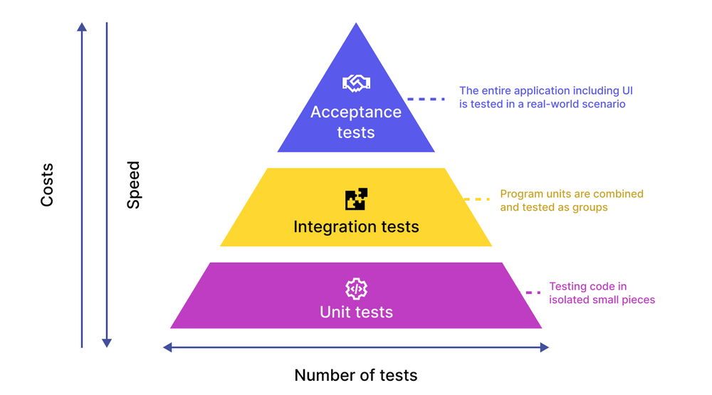

<p align="center">

</p>

# Android Interview Questions

## Contents

* [Big O Notation](#big-o-notation)
* [Data Structures And Algorithms](#data-structures-and-algorithms)
* [Design patterns](#design-patterns)
* [Coding Interview Patterns](#coding-interview-patterns)
* [Kotlin Fundamentals](kotlin-fundamentals)
* [Core Android Components & Fundamentals](#core-android-components-fundamentals)
* [Android Services](#android-services)
* [Long-running Operations in Android](#long-running-operations-in-android)
* [Persistency in Android](#persistency-in-android)
* [Dependency Injection in Android Using Hilt](#dependency-injection-in-android-using-hilt)
* [Architecture Patterns (MVC vs MVP vs MVVM vs MVI)](#architecture-patterns-mvc-vs-mvp-vs-mvvm-vs-mvi)
* [Performance and Profiling in Android](#performance-and-profiling-in-android)
* [The Test Pyramid](#the-test-pyramid)
* [REST APIs](#rest-apis)
* [License](#license)
* [How to contribute?](#how-to-contribute)

## Big O Notation

Big O gives an upper bound on the time or space an algorithm might take, expressed as a function of the input size `n`. It helps compare the efficiency of algorithms regardless of hardware or implementation details.

### Why Use It?

It answers questions like:

- How does the algorithm behave as input grows?
- Will it still be fast with a million inputs?
- Is it faster/slower than another approach?

### Common Big O Complexities

| Big O | Name | Example |
|----|----|----|
| `O(1)`| Constant time	 | Accessing an array element |
| `O(log n)`| Logarithmic time | Binary search |
| `O(n)`| Linear time | Loop through an array |
| `O(n log n)`| 	Linearithmic | Efficient sorts like mergesort |
| `O(n²)`| Quadratic time | Nested loops (e.g., bubble sort) |
| `O(2ⁿ)`| Exponential time | Recursive Fibonacci |
| `O(n!)`| Factorial time | Solving permutations (e.g., TSP) |

### How to Use It

- Identify the input size (`n`): What is growing? Is it an array, a list of nodes, etc.?
- Break down the algorithm into steps or loops.
- Count how many operations run in relation to `n`.
- Drop constants and lower-order terms: e.g., `O(3n + 5)` becomes `O(n)`.

### Examples

#### `O(1)` – Constant Time

```kotlin
fun getFirstElement(list: List<Int>): Int {
    return list[0]  // Always takes the same time
}
```

#### `O(log n)` – Logarithmic Time (e.g., Binary Search)

```kotlin
fun binarySearch(arr: List<Int>, target: Int): Int {
    var left = 0
    var right = arr.size - 1

    while (left <= right) {
        val mid = (left + right) / 2
        when {
            arr[mid] == target -> return mid
            arr[mid] < target -> left = mid + 1
            else -> right = mid - 1
        }
    }
    return -1
}
```

#### `O(n)` – Linear Time

```kotlin
fun printAllElements(list: List<Int>) {
    for (item in list) {
        println(item)
    }
}
```

#### `O(n log n)` – Linearithmic Time (e.g., Merge Sort)

```kotlin
fun mergeSort(list: List<Int>): List<Int> {
    if (list.size <= 1) return list

    val mid = list.size / 2
    val left = mergeSort(list.subList(0, mid))
    val right = mergeSort(list.subList(mid, list.size))

    return merge(left, right)
}

fun merge(left: List<Int>, right: List<Int>): List<Int> {
    val result = mutableListOf<Int>()
    var i = 0
    var j = 0

    while (i < left.size && j < right.size) {
        if (left[i] < right[j]) {
            result.add(left[i++])
        } else {
            result.add(right[j++])
        }
    }
    result.addAll(left.subList(i, left.size))
    result.addAll(right.subList(j, right.size))
    return result
}
```

#### `O(n²)` –  Quadratic Time (e.g., Bubble Sort)

```kotlin
fun bubbleSort(arr: MutableList<Int>) {
    val n = arr.size
    for (i in 0 until n) {
        for (j in 0 until n - i - 1) {
            if (arr[j] > arr[j + 1]) {
                val temp = arr[j]
                arr[j] = arr[j + 1]
                arr[j + 1] = temp
            }
        }
    }
}
```

#### `O(2ⁿ)` –  Exponential Time (e.g., Fibonacci recursion)

```kotlin
fun fibonacci(n: Int): Int {
    if (n <= 1) return n
    return fibonacci(n - 1) + fibonacci(n - 2)
}
```

#### `O(n!)` – Factorial Time (e.g., Generating permutations)

```kotlin
fun permutations(prefix: String, remaining: String) {
    if (remaining.isEmpty()) {
        println(prefix)
    } else {
        for (i in remaining.indices) {
            permutations(
                prefix + remaining[i],
                remaining.substring(0, i) + remaining.substring(i + 1)
            )
        }
    }
}
```

### Tips

- Only the dominant term matters.
- Use Big O to reason about worst-case scenarios.
- Analyze both time and space complexity if relevant.


## Data Structures And Algorithms

The level of questions asked on the topic of Data Structures And Algorithms totally depends on the company for which you are applying.

- Array: An Array consists of a group of elements of the same data type. It is stored contiguously in memory and by using its' index, you can find the underlying data. Arrays can be one dimensional and multi-dimensional. One dimensional array is the simplest data structure, and also most commonly used. It is worth noting that in Java language multi-dimensional array are implemented as arrays of arrays. For example, `int[10][5]` is actually one array with its' cells pointing to ten 5-element arrays.    

| Algorithm | Average | Worst Case |
|:---------:|:-------:|:----------:|
| Space     | Θ(n)    | O(n)       |
| Search    | Θ(n)    | O(n)       |
| Insert    | Θ(n)    | O(n)       |
| Delete    | Θ(n)    | O(n)       |

- LinkedList: A LinkedList, just like a tree and unlike an array, consists of a group of nodes which together represent a sequence. Each node contains data and a pointer. The data in a node can be anything, but the pointer is a reference to the next item in the LinkedList. A LinkedList contains both a head and a tail. The "Head" is the first item in the LinkedList, while the "Tail" is the last item. It is not a circular data structure, therefore the tail does not have its' pointer pointing at the Head - the pointer is just `null`. The run time complexity for each of the base methods are as follows:

| Algorithm | Average | Worst Case |
|:---------:|:-------:|:----------:|
| Space     | Θ(n)    | O(n)       |
| Search    | Θ(n)    | O(n)       |
| Insert    | Θ(1)    | O(1)       |
| Delete    | Θ(1)    | O(1)       |

- DoublyLinkedList: A DoublyLinkedList is based on a LinkedList, but there is two pointers in each node, "previous" pointer holds reference to the previous node and "next" pointer holds reference to the next node. It also has a Head node, head node's next pointer references the first node in this DoublyLinkedList. The last node's "next" reference points to `null`, but if last node's next pointer points to the first node, such DoublyLinkedList is called "Circular DoublyLinkedList". This data structure is very convenient if you need to be able to traverse stored elements in both directions. 

<p align="center">

</p>
    
| Algorithm | Average | Worst Case |
|:---------:|:-------:|:----------:|
| Space     | Θ(n)    | O(n)       |
| Search    | Θ(n)    | O(n)       |
| Insert    | Θ(1)    | O(1)       |
| Delete    | Θ(1)    | O(1)       |

- Stack: A Stack is a basic data structure with a "Last-in-First-out" (LIFO) semantics. This means that the last item that was added to the stack is the first item that comes out of the stack. A Stack is like a stack of books in that in order to get to the first book that was added in the stack (the bottom book), all of the books that were added after need to be removed first. Adding to a Stack is called "Push", removing from a stack is called "Pop", and getting the last item inserted into the stack without removing it is called "Top". The most common way to implement a stack is by using a LinkedList, but there is also StackArray (implemented with an array) which does not replace null entries, and there is also a Vector implementation that does replace `null` entries. [Wikipedia](https://en.wikibooks.org/wiki/Data_Structures/Stacks_and_Queues#Performance_Analysis)

| Algorithm | Average | Worst Case |
|----|----|----|
| Space | Θ(n) | O(n) |
| Search | Θ(n) | O(n) |
| Insert (Push) | Θ(1) | O(1) |
| Delete (Pop) | Θ(1) | O(1) |
| Top | Θ(1) | O(1) |

Image representation:

<p align="center">

</p>

- Queue: Queue is an abstract data structure, somewhat similar to Stacks. Unlike stacks, a queue is open at both its ends. One end is always used to insert data (enqueue) and the other is used to remove data (dequeue). Queue follows First-In-First-Out methodology, i.e., the data item stored first will be accessed first.

- Priority Queue: A priority queue is different from a "normal" queue, because instead of being a "first-in-first-out" data structure, values come out in order by priority. 

- Binary Tree [Wikipedia](https://en.wikipedia.org/wiki/Binary_tree): A binary tree is made of nodes, where each node contains a "left" reference, a "right" reference, and a data element. The topmost node in the tree is called the root. Every node (excluding a root) in a tree is connected by a directed edge from exactly one other node. This node is called a parent. On the other hand, each node can be connected to arbitrary number of nodes, called children. Nodes with no children are called leaves, or external nodes. Nodes which are not leaves are called internal nodes. Nodes with the same parent are called siblings.

- Binary Search Tree: A Binary Search Tree (BST) is a tree in which all the nodes follow the below-mentioned properties:
 - The left sub-tree of a node has a key less than or equal to its parent node's key.
 - The right sub-tree of a node has a key greater than to its parent node's key.

- BST is a collection of nodes arranged in a way where they maintain BST properties. Each node has a key and an associated value. While searching, the desired key is compared to the keys in BST and if found, the associated value is retrieved.

  - Search 

	```java
	public Node search(Node root, int key) {
	    // Base Cases: root is null or key is present at root
	    if (root==null || root.key==key)
	        return root;
	    // val is greater than root's key
	    if (root.key > key)
	        return search(root.left, key);
	    // val is less than root's key
	    return search(root.right, key);
	}
	```
  
  - Insert
	
	```java
	// This method mainly calls insertRec()
	void insert(int key) {
	   root = insertRec(root, key);
	}
	 
	/* A recursive function to insert a new key in BST */
	Node insertRec(Node root, int key) {
	    /* If the tree is empty, return a new node */
	    if (root == null) {
	        root = new Node(key);
	        return root;
	    }
	    /* Otherwise, recur down the tree */
	    if (key < root.key)
	        root.left = insertRec(root.left, key);
	    else if (key > root.key)
	        root.right = insertRec(root.right, key);
	 
	    /* return the (unchanged) node pointer */
	    return root;
	}
	```
	
  - Delete
	
	```java
	// This method mainly calls deleteRec()
	void deleteKey(int key) {
		root = deleteRec(root, key);
	}
	 
	/* A recursive function to insert a new key in BST */
	Node deleteRec(Node root, int key) {
	    /* Base Case: If the tree is empty */
	    if (root == null)  return root;
	    /* Otherwise, recur down the tree */
	    if (key < root.key)
	        root.left = deleteRec(root.left, key);
	    else if (key > root.key)
	        root.right = deleteRec(root.right, key);
	        // if key is same as root's key, then This is 
	        // the node to be deleted
	    else {
	        // node with only one child or no child
	        if (root.left == null)
	            return root.right;
	        else if (root.right == null)
	            return root.left;
	        // node with two children: Get the inorder
	        // successor (smallest in the right subtree)
	        root.key = minValue(root.right);
	        // Delete the inorder successor
	        root.right = deleteRec(root.right, root.key);
	    }
	    return root;
	}
	```

  - Pre Order traversal
		
	```java
	void printPreorder(Node node) {
	    if (node == null)
	        return;
	    /* then print the data of node */
	    System.out.print(node.key + " ");
	    /* first recur on left child */
	    printPreorder(node.left);
	    /* now recur on right child */
	    printPreorder(node.right);
	}
	```
	
  - In Order traversal :
		
	```java
	void printInorder(Node node) {
	    if (node == null)
	        return;
	    /* first recur on left child */
	    printInorder(node.left);
	    /* then print the data of node */
	    System.out.print(node.key + " ");
	    /* now recur on right child */
	    printInorder(node.right);
	}
	```
		
  - Post Order traversal :
		
	```java
	void printPostorder(Node node) {
	    if (node == null)
	        return;
	    /* first recur on left child */
	    printPostorder(node.left);
	    /* now recur on right child */
	    printPostorder(node.right);
	    /* then print the data of node */
	    System.out.print(node.key + " ");
	}
	```

  - Maximum Depth or Height of a Tree :
	
	```java
	int maxDepth(Node node) { 
		if (node == null) return 0;
		else {
			return Math.max(
				maxDepth(node.left) + 1,
				maxDepth(node.right) + 1);
		}
	} 
	```

- Hash Table or Hash Map: A Hash Table is a data structure that implements an associative array abstract data type, a structure that can map keys to values. A hash table uses a hash function to compute an index into an array of buckets or slots, from which the desired value can be found. Ideally, the hash function will assign each key to a unique bucket, but most hash table designs employ an imperfect hash function, which might cause hash collisions where the hash function generates the same index for more than one key. Such collisions must be accommodated in some way.

In a well-dimensioned hash table, the average cost (number of instructions) for each lookup is independent of the number of elements stored in the table. Many hash table designs also allow arbitrary insertions and deletions of key-value pairs, at (amortized) constant average cost per operation. In many situations, hash tables turn out to be on average more efficient than search trees or any other table lookup structure. For this reason, they are widely used in many kinds of computer software, particularly for associative arrays, database indexing, caches, and sets.

- Sorting Algorithms [Wikipedia](https://en.wikipedia.org/wiki/Sorting_algorithm?oldformat=true):

Using the most efficient sorting algorithm (and correct data structures that implement it) is vital for any program, because data manipulation can be one of the most significant bottlenecks in case of performance and the main purpose of spending time, determining the best algorithm for the job, is to drastically improve said performance. The efficiency of an algorithm is measured in its' "Big O" ([StackOverflow](https://stackoverflow.com/questions/487258/what-is-a-plain-english-explanation-of-big-o-notation)) score. Really good algorithms perform important actions in O(n log n) or even O(log n) time and some of them can even perform certain actions in O(1) time (HashTable insertion, for example). But there is always a trade-off - if some algorithm is really good at adding a new element to a data structure, it is, most certainly, much worse at data access than some other algorithm. If you are proficient with math, you may notice that "Big O" notation has many similarities with "limits", and you would be right - it measures best, worst and average performances of an algorithm in question, by looking at its' function limit. It should be noted that, when we are speaking about O(1) - constant time - we are not saying that this algorithm performs an action in one operation, rather that it can perform this action with the same number of operations (roughly), regrardless of the amount of elements it has to take into account. Thankfully, a lot of "Big O" scores have been already calculated, so you don't have to guess, which algorithm or data structure will perform better in your project. ["Big O" cheat sheet](http://bigocheatsheet.com/)

| Algorithm | Best (Time) | Average (Time) | Worst (Time) | Space (Worst) |
|----|----|----|----|----|
| [Quicksort](http://en.wikipedia.org/wiki/Quicksort) | Ω(n log(n)) | Θ(n log(n)) | O(n^2) | O(log(n)) |
| [Mergesort](http://en.wikipedia.org/wiki/Merge_sort) | Ω(n log(n)) | Θ(n log(n)) | O(n log(n)) | O(n) |
| [Timsort](http://en.wikipedia.org/wiki/Timsort) | Ω(n) | Θ(n log(n)) | O(n log(n)) | O(n) |
| [Heapsort](http://en.wikipedia.org/wiki/Heapsort) | Ω(n log(n)) | Θ(n log(n)) | O(n log(n)) | O(1) |
| [Bubble Sort](http://en.wikipedia.org/wiki/Bubble_sort) | Ω(n) | Θ(n^2) | O(n^2) | O(1) |
| [Insertion Sort](http://en.wikipedia.org/wiki/Insertion_sort) | Ω(n) | Θ(n^2) | O(n^2) | O(1) |
| [Selection Sort](http://en.wikipedia.org/wiki/Selection_sort) | Ω(n^2) | Θ(n^2) | O(n^2) | O(1) |
| [Tree Sort](http://en.wikipedia.org/wiki/Tree_sort) | Ω(n log(n)) | Θ(n log(n)) | O(n^2) | O(n) |
| [Shell Sort](http://en.wikipedia.org/wiki/Shellsort) | Ω(n log(n)) | Θ(n(log(n))^2) | O(n(log(n))^2) | O(1) |
| [Bucket Sort](http://en.wikipedia.org/wiki/Bucket_sort) (Only for integers. `k` is a number of buckets) | Ω(n+k) | Θ(n+k) | O(n^2) | O(n) |
| [Radix Sort](http://en.wikipedia.org/wiki/Radix_sort) (Constant number of digits `k`) | Ω(nk) | Θ(nk) | O(nk) | O(n+k) |
| [Counting Sort](http://en.wikipedia.org/wiki/Counting_sort) (Difference between maximum and minimum number `k`) | Ω(n+k) | Θ(n+k) | O(n+k) | O(k) |
| [Cubesort](http://en.wikipedia.org/wiki/Cubesort) | Ω(n) | Θ(n log(n)) | O(n log(n)) | O(n) |

- Bubble sort [Wikipedia](https://en.wikipedia.org/wiki/Bubble_sort?oldformat=true): Bubble sort is one of the simplest sorting algorithms. It just compares neighbouring elements and if the one that precedes the other is smaller - it changes their places. So over one iteration over the data list, it is guaranteed that **at least** one element will be in its' correct place (the biggest/smallest one - depending on the direction of sorting). This is not a very efficient algorithm, as highly unordered arrays will require a lot of reordering (upto O(n^2)), but one of the advantages of this algorithm is its' space complexity - only two elements are compared at once and there is no need to allocate more memory, than those two will occupy. 

| Best (Time) | Average (Time) | Worst (Time) | Space (Worst) |
|----|----|----|----|
| Ω(n) | Θ(n^2) | O(n^2) | O(1) |
            
```java
static void bubbleSort(int[] arr) {
    int n = arr.length;
    int temp = 0;
    for (int i = 0; i < n; i++) {
        for (int j = 1; j < (n - i); j++) {
            if (arr[j - 1] > arr[j]) {
                // swap elements
                temp = arr[j - 1];
                arr[j - 1] = arr[j];
                arr[j] = temp;
            }
        }
    }
}
```
	
 - Selection sort [Wikipedia](https://www.wikiwand.com/en/Selection_sort): Firstly, selection sort assumes that the first element of the array to be sorted is the smallest, but to confirm this, it iterates over all other elements to check, and if it finds one, it gets defined as the smallest one. When the data ends, the element, that is currently found to be the smallest, is put in the beginning of the array. This sorting algorithm is quite straightforward, but still not that efficient on larger data sets, because to assign just one element to its' place, it needs to go over all data.

| Best (Time) | Average (Time) | Worst (Time) | Space (Worst) |
|----|----|----|----|
| Ω(n^2) | Θ(n^2) | O(n^2) | O(1) |

```java
public static void selectionSort(int[] arr) {
    for (int i = 0; i < arr.length - 1; i++) {
        int index = i;
        for (int j = i + 1; j < arr.length; j++) {
            if (arr[j] < arr[index]) {
                index = j;//searching for lowest index
            }
        }
        int smallerNumber = arr[index];
        arr[index] = arr[i];
        arr[i] = smallerNumber;
    }
}
```
	
- Insertion sort [Wikipedia](https://en.wikipedia.org/wiki/Insertion_sort?oldformat=true): Insertion sort is another example of an algorithm, that is not that difficult to implement, but is also not that efficient. To do its' job, it "grows" sorted portion of data, by "inserting" new encountered elements into already (innerly) sorted part of the array, which consists of previously encountered elements. This means that in best case (data is already sorted) it can confirm that its' job is done in Ω(n) operations, while, if all encountered elements are not in their required order as many as O(n^2) operations may be needed.

| Best (Time) | Average (Time) | Worst (Time) | Space (Worst) |
|----|----|----|----|
| Ω(n) | Θ(n^2) | O(n^2) | O(1) |
            
```java
public static void insertionSort(int array[]) {  
    int n = array.length;  
    for (int j = 1; j < n; j++) {  
        int key = array[j];  
        int i = j - 1;  
        while ((i > -1) && ( array [i] > key )) {  
            array [i+1] = array [i];  
            i--;  
        }  
        array[i+1] = key;  
    }  
}
```
 - Merge sort [Wikipedia](https://en.wikipedia.org/wiki/Merge_sort?oldformat=true): This is a "divide and conquer" algorithm, meaning it recursively "divides" given array in to smaller parts (up to 1 element) and then sorts those parts, combining them with each other. This approach allows merge sort to achieve very high speed, while  doubling required space, of course, but today memory space is more available than it was a couple of years ago, so this trade-off is considered acceptable.

| Best (Time) | Average (Time) | Worst (Time) | Space (Worst) |
|----|----|----|----|
| Ω(n log(n)) | Θ(n log(n)) | O(n log(n)) | O(n) |

```java
public static void merge(int arr[], int beg, int mid, int end) {
    int l = mid - beg + 1;
    int r = end - mid;
    int leftArray[] = new int[l];
    int rightArray[] = new int[r];
    for (int i = 0; i < l; ++i)
        leftArray[i] = arr[beg + i];
    for (int j = 0; j < r; ++j)
        rightArray[j] = arr[mid + 1 + j];
    int i = 0, j = 0;
    int k = beg;
    while (i < l && j < r) {
        if (leftArray[i] <= rightArray[j]) {
            arr[k] = leftArray[i];
            i++;
        } else  {
            arr[k] = rightArray[j];
            j++;
        }
        k++;
    }
    while (i < l) {
        arr[k] = leftArray[i];
        i++;
        k++;
    }
    while (j < r) {
        arr[k] = rightArray[j];
        j++;
        k++;
    }
}

public static void sort(int arr[], int beg, int end) {
    if (beg < end) {
        int mid = (beg + end) / 2;
        sort(arr, beg, mid);
        sort(arr, mid + 1, end);
        merge(arr, beg, mid, end);
    }
}
```

 - Quicksort [Wikipedia](https://en.wikipedia.org/wiki/Quicksort?oldformat=true): Quicksort is considered, well, quite quick. When implemented correctly, it can be a significant number of times faster than its' main competitors. This algorithm is also of "divide and conquer" family and its' first step is to choose a "pivot" element (choosing it randomly, statistically, minimizes the chance to get the worst performance), then by comparing elements to this pivot, moving it closer and closer to its' final place. During this process, the elements that are bigger are moved to the right side of it and smaller elements to the left. After this is done, quicksort repeats this process for subarrays on each side of placed pivot (does first step recursively), until the array is sorted.

| Best (Time) | Average (Time) | Worst (Time) | Space (Worst) |
|----|----|----|----|
| Ω(n log(n)) | Θ(n log(n)) | O(n^2) | O(1) |

```java
public static int partition(int a[], int beg, int end) {
    int left, right, temp, loc, flag;
    loc = left = beg;
    right = end;
    flag = 0;
    while (flag != 1) {
        while ((a[loc] <= a[right]) && (loc != right))
            right--;
        if (loc == right)
            flag = 1;
        else if (a[loc] > a[right]) {
            temp = a[loc];
            a[loc] = a[right];
            a[right] = temp;
            loc = right;
        }
        if (flag != 1) {
            while ((a[loc] >= a[left]) && (loc != left))
                left++;
            if (loc == left)
                flag = 1;
            else if (a[loc] < a[left]) {
                temp = a[loc];
                a[loc] = a[left];
                a[left] = temp;
                loc = left;
            }
        }
    }
    return loc;
}

static void quickSort(int a[], int beg, int end) {
    int loc;
    if (beg < end) {
        loc = partition(a, beg, end);
        quickSort(a, beg, loc - 1);
        quickSort(a, loc + 1, end);
    }
}
```
    
- There are, of course, more sorting algorithms and their modifications. We strongly recommend all readers to familiarize themselves with a couple more, because knowing algorithms is very important quality of a candidate, applying for a job and it shows understanding of what is happening "under the hood".

### Dynamic Programming

Dynamic Programming is mainly an optimization over plain [recursion](https://www.geeksforgeeks.org/recursion/). Wherever we see a recursive solution that has repeated calls for same inputs, we can optimize it using Dynamic Programming. The idea is to simply store the results of subproblems, so that we do not have to re-compute them when needed later. This simple optimization reduces time complexities from exponential to polynomial. For example, if we write simple recursive solution for [Fibonacci Numbers](https://www.geeksforgeeks.org/program-for-nth-fibonacci-number/), we get exponential time complexity and if we optimize it by storing solutions of subproblems, time complexity reduces to linear.

<p align="center">

</p>

### Greedy Algorithm

Greedy is an algorithmic paradigm that builds up a solution piece by piece, always choosing the next piece that offers the most obvious and immediate benefit. So the problems where choosing locally optimal also leads to global solution are best fit for Greedy.

For example consider the [Fractional Knapsack Problem](https://www.geeksforgeeks.org/fractional-knapsack-problem/). The local optimal strategy is to choose the item that has maximum value vs weight ratio. This strategy also leads to global optimal solution because we allowed to take fractions of an item.

<p align="center">

</p>

### String Manipulation

- The longest common subsequence (LCS) problem is the problem of finding the longest subsequence common to all sequences in a set of sequences (often just two sequences). It differs from the longest common substring problem: unlike substrings, subsequences are not required to occupy consecutive positions within the original sequences.

```java
static int lcs(String s1, String s2) {
	int size_1 = s1.length();
	int size_2 = s2.length();
	int[][] cmn = new int[size_1][size_2];
	for (int y = 0; y < size_1; y++) {
		for (int x = 0; x < size_2; x++) {
			if (s1.charAt(y) == s2.charAt(x)) {
				int temp = 1;
				if (x > 0 && y > 0)
					temp = cmn[y - 1][x - 1] + 1;
				cmn[y][x] = temp;
			} else {
				int temp_1 = x == 0 ? 0 : cmn[y][x - 1];
				int temp_2 = y == 0 ? 0 : cmn[y - 1][x];
				cmn[y][x] = Math.max(temp_1, temp_2);
			}
		}
	}
	return cmn[size_1 - 1][size_2 - 1];
}
```

- A permutation, also called an “arrangement number” or “order, ” is a rearrangement of the elements of an ordered list S into a one-to-one correspondence with S itself. A string of length n has n! permutation. The permutations of string "ABC" are ["ABC", "ACB", "BAC", "BCA", "CBA", "CAB"].

```java
static void permute(String s, ArrayList<String> p, int l, r int) {
	if (l == r) { p.add(s); } 
	else {
		for (int i = l; i <= r; i++) {
			String tmp = swap(s, l, i);
			permute(tmp, p, l + 1, r);
		}
	}
}
	
static String swap(String s, int l, int r) {
	return s.substring(0, l) + s.charAt(r) + s.substring(l + 1, r) + s.substring(r + 1);
}
```

### Pathfinding algorithms [Wikipedia](https://en.wikipedia.org/wiki/Greedy_algorithm?oldformat=true)

- Dijkstra algorithm
- A* algorithm
- Breadth First Search: BFS is a traversing algorithm where you should start traversing from a selected node (source or starting node) and traverse the graph layerwise thus exploring the neighbour nodes (nodes which are directly connected to source node). You must then move towards the next-level neighbour nodes. As the name BFS suggests, you are required to traverse the graph breadthwise as follows:
 - First move horizontally and visit all the nodes of the current layer
 - Move to the next layer
	
```java
void BFS(Node root) {
	// BFS uses Queue data structure
	Queue queue = new LinkedList();
	queue.add(root);
	printNode(root);
	rootNode.visited = true;
	while(!queue.isEmpty()) {
		Node node = (Node)queue.remove();
		Node child = null;
		while((child = getUnvisitedChildNode(node)) != null) {
			child.visited = true;
			printNode(child);
			queue.add(child);
		}
	}
	// Clear visited property of nodes
	clearNodes();
}
```

- Depth First Search: DFS is another uninformed graph traversal algorithm which produces a non-optimal solution but can be useful for traversing quickly into deeper search domains. Depth first search is very similar to the BFS. With Depth first search you start at the top most node in a tree and then follow the left most branch until there exists no more leafs in that branch. At that point you will search the nearest ancestor with unexplored nodes until such time as you find the goal node.

```java
void DFS(Node root) {
	// DFS uses Dequeue data structure
	Deque deque = new ArrayDeque();
	deque.add(root);
	printNode(root);
	rootNode.visited = true;
	while(!deque.isEmpty()) {
		Node node = (Node)deque.remove();
		Node child = null;
		while((child = getUnvisitedChildNode(node)) != null) {
			child.visited = true;
			printNode(child);
			deque.add(child);
		}
	}
	// Clear visited property of nodes
	clearNodes();
}
```

## Design patterns

### Creational patterns

- Builder [Wikipedia](https://en.wikipedia.org/wiki/Builder_pattern?oldformat=true). The intent of the Builder design pattern is to separate the construction of a complex object from its representation. By doing so the same construction process can create different representations. Encapsulate creating and assembling the parts of a complex object in a separate Builder object. A class delegates object creation to a Builder object instead of creating the objects directly.

- Factory [Wikipedia](https://en.wikipedia.org/wiki/Factory_method_pattern). Creating an object often requires complex processes not appropriate to include within a composing object. The object's creation may lead to a significant duplication of code, may require information not accessible to the composing object, may not provide a sufficient level of abstraction, or may otherwise not be part of the composing object's concerns. The factory method design pattern handles these problems by defining a separate method for creating the objects, which subclasses can then override to specify the derived type of product that will be created. The factory method pattern relies on inheritance, as object creation is delegated to subclasses that implement the factory method to create objects.

- Singleton [Wikipedia](https://en.wikipedia.org/wiki/Singleton_pattern). A singleton is a class that can only be instantiated once. This singleton pattern restricts the instantiation of a class to one object. This is useful when exactly one object is needed to coordinate actions across the system. The concept is sometimes generalized to systems that operate more efficiently when only one object exists, or that restrict the instantiation to a certain number of objects.

### Structural patterns

- Adapter [Wikipedia](https://en.wikipedia.org/wiki/Adapter_pattern). The adapter pattern is a software design pattern (also known as wrapper, an alternative naming shared with the decorator pattern) that allows the interface of an existing class to be used as another interface. It is often used to make existing classes work with others without modifying their source code. An example is an adapter that converts the interface of a Document Object Model of an XML document into a tree structure that can be displayed.
- Decorator [Wikipedia](https://en.wikipedia.org/wiki/Decorator_pattern). The decorator pattern is a design pattern that allows behavior to be added to an individual object, dynamically, without affecting the behavior of other objects from the same class. The decorator pattern is often useful for adhering to the Single Responsibility Principle, as it allows functionality to be divided between classes with unique areas of concern. The decorator pattern is structurally nearly identical to the chain of responsibility pattern, the difference being that in a chain of responsibility, exactly one of the classes handles the request, while for the decorator, all classes handle the request.
- Facade [Wikipedia](https://en.wikipedia.org/wiki/Facade_pattern). Facade design pattern is commonly used when a system is very complex or difficult to understand because the system has a large number of interdependent classes or because its source code is unavailable. This pattern hides the complexities of the larger system and provides a simpler interface to the client. It typically involves a single wrapper class that contains a set of members required by the client. These members access the system on behalf of the facade client and hide the implementation details.

### Behavioural patterns

- Chain of responsibility [Wikipedia](https://en.wikipedia.org/wiki/Chain-of-responsibility_pattern). Is a design pattern consisting of a source of command objects and a series of processing objects. Each processing object contains logic that defines the types of command objects that it can handle; the rest are passed to the next processing object in the chain. A mechanism also exists for adding new processing objects to the end of this chain. Thus, the chain of responsibility is an object oriented version of the if ... else if ... else if ....... else ... endif idiom, with the benefit that the condition–action blocks can be dynamically rearranged and reconfigured at runtime. The chain-of-responsibility pattern is structurally nearly identical to the decorator pattern, the difference being that for the decorator, all classes handle the request, while for the chain of responsibility, exactly one of the classes in the chain handles the request.
- Iterator [Wikipedia](https://en.wikipedia.org/wiki/Iterator_pattern). The essence of the Iterator Pattern is to "Provide a way to access the elements of an aggregate object sequentially without exposing its underlying representation."
- Strategy [Wikipedia](https://en.wikipedia.org/wiki/Strategy_pattern). The strategy pattern (also known as the policy pattern) is a behavioral software design pattern that enables selecting an algorithm at runtime. Instead of implementing a single algorithm directly, code receives run-time instructions as to which in a family of algorithms to use. Strategy lets the algorithm vary independently from clients that use it. Strategy is one of the patterns included in the influential book Design Patterns by Gamma et al. that popularized the concept of using design patterns to describe how to design flexible and reusable object-oriented software. Deferring the decision about which algorithm to use until runtime allows the calling code to be more flexible and reusable. 
- Observer [Wikipedia](https://en.wikipedia.org/wiki/Observer_pattern). The observer pattern is a software design pattern in which an object, called the subject, maintains a list of its dependents, called observers, and notifies them automatically of any state changes, usually by calling one of their methods. It is mainly used to implement distributed event handling systems, in "event driven" software. Most modern languages such as C# have built in "event" constructs which implement the observer pattern components, for easy programming and short code.

## Coding Interview Patterns

### Two Pointers

Used when working with sorted arrays or searching for pairs. Helps reduce nested loops to linear time.

```kotlin
fun hasPairWithSum(arr: IntArray, target: Int): Boolean {
    var left = 0
    var right = arr.lastIndex
    while (left < right) {
        val sum = arr[left] + arr[right]
        when {
            sum == target -> return true
            sum < target -> left++
            else -> right--
        }
    }
    return false
}
```

### Sliding Window

Efficient for problems involving contiguous subarrays/substrings. Avoids recomputing on overlapping data.

```kotlin
fun maxSumSubarray(arr: IntArray, k: Int): Int {
    var maxSum = 0
    var windowSum = 0
    for (i in arr.indices) {
        windowSum += arr[i]
        if (i >= k) windowSum -= arr[i - k]
        if (i >= k - 1) maxSum = maxOf(maxSum, windowSum)
    }
    return maxSum
}
```

### Divide and Conquer

Breaks a problem into smaller subproblems, solves them independently, and combines the results.

```kotlin
fun mergeSort(arr: IntArray): IntArray {
    if (arr.size <= 1) return arr
    val mid = arr.size / 2
    val left = mergeSort(arr.sliceArray(0 until mid))
    val right = mergeSort(arr.sliceArray(mid until arr.size))
    return merge(left, right)
}
```

### Dynamic Programming

Solves problems with overlapping subproblems by storing and reusing results to avoid recomputation.

```kotlin
fun fib(n: Int): Int {
    if (n <= 1) return n
    val dp = IntArray(n + 1)
    dp[1] = 1
    for (i in 2..n) dp[i] = dp[i - 1] + dp[i - 2]
    return dp[n]
}
```

### Greedy

Builds up a solution piece by piece, always choosing the best next step (local optimum) at each stage.

```kotlin
fun jumpGame(nums: IntArray): Boolean {
    var maxReach = 0
    for (i in nums.indices) {
        if (i > maxReach) return false
        maxReach = maxOf(maxReach, i + nums[i])
    }
    return true
}
```

### DFS / BFS

Traversal techniques for trees, graphs, and grids. DFS uses recursion or stack; BFS uses a queue.

```kotlin
fun dfs(graph: Map<Int, List<Int>>, start: Int, visited: MutableSet<Int>) {
    if (start in visited) return
    visited.add(start)
    for (neighbor in graph[start] ?: listOf()) {
        dfs(graph, neighbor, visited)
    }
}

fun bfs(graph: Map<Int, List<Int>>, start: Int) {
    val queue = ArrayDeque<Int>()
    val visited = mutableSetOf<Int>()
    queue.add(start)
    while (queue.isNotEmpty()) {
        val node = queue.removeFirst()
        if (node in visited) continue
        visited.add(node)
        queue.addAll(graph[node] ?: listOf())
    }
}
```

### Binary Search

Used on sorted data to repeatedly halve the search space. Time complexity: O(log n).

```kotlin
fun binarySearch(arr: IntArray, target: Int): Int {
    var left = 0
    var right = arr.lastIndex
    while (left <= right) {
        val mid = (left + right) / 2
        when {
            arr[mid] == target -> return mid
            arr[mid] < target -> left = mid + 1
            else -> right = mid - 1
        }
    }
    return -1
}
```

### Union-Find (Disjoint Set)

A data structure for tracking a set of elements split into disjoint subsets. Common in graph cycle detection.

```kotlin
class UnionFind(n: Int) {
    private val parent = IntArray(n) { it }

    fun find(x: Int): Int {
        if (parent[x] != x) parent[x] = find(parent[x])
        return parent[x]
    }

    fun union(x: Int, y: Int) {
        val rootX = find(x)
        val rootY = find(y)
        if (rootX != rootY) parent[rootY] = rootX
    }
}
```

### Bit Manipulation

Efficient for low-level data tasks: toggling bits, checking parity, or solving subset problems.

```kotlin
fun singleNumber(nums: IntArray): Int {
    var result = 0
    for (num in nums) {
        result = result xor num
    }
    return result
}
```

### Topological Sort

For ordering nodes in a DAG (Directed Acyclic Graph) where dependencies exist.

```kotlin
fun topologicalSort(graph: Map<Int, List<Int>>, numNodes: Int): List<Int> {
    val inDegree = IntArray(numNodes)
    for (edges in graph.values) {
        for (node in edges) inDegree[node]++
    }

    val queue = ArrayDeque<Int>()
    for (i in 0 until numNodes) {
        if (inDegree[i] == 0) queue.add(i)
    }

    val order = mutableListOf<Int>()
    while (queue.isNotEmpty()) {
        val node = queue.removeFirst()
        order.add(node)
        for (neighbor in graph[node] ?: listOf()) {
            inDegree[neighbor]--
            if (inDegree[neighbor] == 0) queue.add(neighbor)
        }
    }

    return if (order.size == numNodes) order else emptyList()
}
```

### What, When, and Why

| Pattern | What It Is | When to Use | Why It’s Useful |
|----|----|----|----|
| Two Pointers | Use two indices to traverse from different ends or speeds. | Arrays or strings that are sorted or need pair-based logic. | Reduces nested loops to linear time. |
| Sliding Window | Maintain a window over part of a sequence and move it efficiently. | Subarray/substring problems where you track max/min/sum/count in a window. | Avoids recalculating overlapping data. |
| Divide & Conquer | Break problem into smaller subproblems, solve independently, and combine. | Sorting, searching, and recursive breakdowns (e.g., merge sort, binary search). | Makes complex problems manageable recursively. |
| Dynamic Programming (DP) | Store and reuse results of overlapping subproblems. | Optimal substructure + overlapping subproblems (e.g., Fibonacci, knapsack). | Converts exponential brute force to polynomial time. |
| Greedy | Make locally optimal choices hoping for a global optimum. | Optimization problems like scheduling, intervals, or coin change. | Simpler and faster than DP (when applicable). |
| DFS / BFS | Traverse trees, graphs, or grids in depth or breadth first. | Graph traversal, connected components, maze solving, shortest paths. | Standard traversal tools in graph-related problems. |
| Binary Search | Repeatedly divide a sorted array to find a target. | When the input is sorted or when checking a "yes/no" condition over a range. | Very fast search: `O(log n)`. |
| Union-Find (DSU) | Track disjoint sets and efficiently merge/find their roots. | When managing groups/connected components or detecting cycles. | Great for Kruskal’s MST or "are they connected?" queries. |
| Bit Manipulation | Directly manipulate bits of integers. | Low-level tasks like power-of-two checks, subsets, toggles, or `XOR` tricks. | Super-efficient for state space or uniqueness checks. |
| Topological Sort | Linear ordering of a DAG based on dependencies. | Tasks with prerequisites (e.g., course schedule, job build order). | Ensures valid order when dependencies must be respected. |

### Useful tips

- If a brute force solution is `O(n²)` or worse, look for Sliding Window, Two Pointers, or DP.
- If the data is sorted, consider Binary Search or Two Pointers.
- If the problem involves choices/paths, consider Backtracking, DFS, or Greedy.
- If there's state reuse, think DP.
- If you're told something like "you can do this task only after another", that's a hint for Topological Sort.

## Kotlin Fundamentals

Kotlin is a modern programming language that is officially supported for Android development and is designed to be fully interoperable with Java while providing powerful features to improve developer productivity. Here are some of the basics of Kotlin language that every developer should know:

### Basic Syntax

Hello World:
	
```kotlin
fun main() {

	println("Hello, World!")
}
```

### Variables

Kotlin has two main ways to declare variables:

- `val` for read-only (immutable) variables.
- `var` for mutable variables.

```kotlin
val name: String = "Kotlin" // Immutable
var age: Int = 5 // Mutable
```

### Data Types

Kotlin has several foundational data types, including:
	
- Numeric Types: `Int`, `Double`, `Float`, `Long`, `Short`, `Byte`
- Character Type: `Char`
- Boolean Type: `Boolean`
- String Type: `String`

```kotlin
val number: Int = 25
val pi: Double = 3.14
val isKotlinFun: Boolean = true
```
	
### Control Flow

Kotlin supports standard control flow constructs such as if, when, for, and while.

- `if` Expression:

```kotlin
val max = if (a > b) a else b
```

- `when` Expression:
	
```kotlin
when (x) {
    1 -> println("x is 1")
    2 -> println("x is 2")
    else -> println("x is neither 1 nor 2")
}
```

- `for` Loop:

```kotlin
for (item in collection) {
    println(item)
}
```
	
### Functions

Kotlin allows you to define functions in a straightforward way:

- Basic function:

```kotlin
fun add(a: Int, b: Int): Int {
    return a + b
}
```

- Single expression function:

```kotlin
fun multiply(a: Int, b: Int) = a * b
```

### Classes and Objects

Kotlin is an object-oriented language that supports class creation with properties and methods.

- Class Declaration:

```kotlin
class Person(val name: String, var age: Int) {

    fun introduce() {
        println("Hi, my name is $name and I am $age years old.")
    }
}
```

- Creating an Object:

```kotlin
val person = Person("John", 30)
person.introduce()
```

- Data Classes

Kotlin provides a convenient way to create classes meant to hold data with generated `toString()`, `equals()`, `hashCode()`, and `copy()` methods.

```kotlin
data class User(val name: String, val age: Int)
val user1 = User("Alice", 25)
val user2 = user1.copy(age = 26) // Using the copy method
```

### Null Safety

Kotlin has built-in null safety, which helps prevent null pointer exceptions.


- Nullable Types: Use ? to declare a variable that can hold a `null` value.

```kotlin
var name: String? = null
```

- Safe Calls: Use `?.` to call methods or properties only if the object is not `null`.

```kotlin
println(name?.length) // Will not throw an exception if name is null
```

### Lambda Expressions

Kotlin supports first-class function types and lambda expressions, which can be used for functional programming.

```kotlin
val sum: (Int, Int) -> Int = { x, y -> x + y }
println(sum(2, 3)) // Output: 5
```

### Collections

Kotlin has a rich and expressive API for working with collections, including lists, sets, and maps.

```kotlin
val list = listOf(1, 2, 3)
val map = mapOf("key" to "value", "key2" to "value2")
```

### Extension Functions

Kotlin allows you to extend existing classes with new functionality without modifying their source code.

```kotlin
fun String.addExclamation() = this + "!"
println("Hello".addExclamation()) // Output: Hello!
```

### Conclusion

Kotlin offers several advantages over Java, enhancing developer productivity and code quality. Its concise syntax significantly reduces boilerplate code, making it easier to read and write. Features like null safety help prevent null pointer exceptions, a common issue in Java, leading to more robust applications. Kotlin also supports functional programming paradigms through higher-order functions and extension functions, allowing developers to write cleaner and more flexible code. Additionally, Kotlin provides full interoperability with Java, enabling gradual migration of existing Java projects to Kotlin without disruption. Overall, Kotlin's modern language features and enhanced safety mechanisms make it a compelling choice for contemporary development, especially in Android applications.

You can learn more about the language in the [Get started with Kotlin](https://kotlinlang.org/docs/getting-started.html) page, and read more about its documentation [here](https://kotlinlang.org/docs/home.html).

## Core Android Components & Fundamentals

### What are the four main components of Android?
	
1. Activities - Represents a single UI screen (e.g., Login Screen, Home Screen).
2. Services - Runs in the background for long-running operations (e.g., music playback, fetching data).
3. Broadcast Receivers - Listens to system-wide events (e.g., battery low, network state changes).
4. Content Providers - Manages data sharing between apps (e.g., contacts, media storage).

### What is the difference between an Activity and a Fragment?
	
| Feature | Activity | Fragment |
|----|----|----|
| UI Component | Represents a full screen | Part of an Activity, can be reused |
| Lifecycle | Independent | Dependent on Activity | 
| Navigation | Managed by Android | Requires FragmentManager |
| Use Case | App's main screens | Modular UI elements |

### What are the different types of Services in Android?

1. Foreground Service: Runs with a visible notification (e.g., music player, GPS tracking).
2. Background Service: Runs without UI (deprecated in Android 8+; use WorkManager instead).
3. Bound Service: Provides a client-server interface (e.g., for music playback APIs).

### How does the Android Activity Lifecycle work?

- **onCreate()**: Initializes activity (e.g., setContentView, initialize variables).
- **onStart()**: Activity becomes visible.
- **onResume()**: Activity is in the foreground (user can interact).
- **onPause()**: Activity is partially visible (e.g., dialog appears on top).
- **onStop()**: Activity is no longer visible.
- **onDestroy()**: Activity is being destroyed (clean up resources).
- **onRestart()**: Called when resuming a stopped activity.

<p align="center">

</p> 

### How does the Android Fragment Lifecycle work?

A Fragment’s lifecycle is tightly bound to the Activity it is associated with, and it can be added or removed from the Activity dynamically. Below is a detailed description of the key stages in the Fragment lifecycle:
 
- **onAttach(Context context)** : Called when the Fragment is first attached to the Activity. Fragment and Activity are now linked, and you can access the Activity's context here. This method is called once in the fragment's lifecycle.
- **onCreate(Bundle savedInstanceState)** : Called when the Fragment is being created. You initialize essential components or resources here (e.g., create ViewModel). If there's any saved state (e.g., from a previous fragment transaction), it’s passed via savedInstanceState. Note: This is not where the fragment’s layout is created.
- **onCreateView(LayoutInflater inflater, ViewGroup container, Bundle savedInstanceState)** : Called to create the view for the fragment. You inflate the fragment’s layout here by calling inflater.inflate() and return the root view. This method is called when the fragment is created and the view hierarchy is created.
- **onActivityCreated(Bundle savedInstanceState)** : Called when the Activity’s onCreate() method has finished, and the Fragment’s view is fully created. You can initialize your fragment’s UI components here, such as binding views or setting up adapters.
- **onStart()** : Called when the Fragment becomes visible to the user. It indicates the Fragment is now running, and you can initialize any components that require interaction with the user.
- **onResume()** : Called when the Fragment is fully visible and interactive. This is the point where the fragment becomes active, and any UI-related logic such as starting animations, network calls, or resuming video playback should be handled.
- **onPause()** : Called when the Fragment is no longer in the foreground but is still visible (e.g., the user is switching to another app or Activity). You should pause any ongoing operations here, like stopping animations, video playback, or saving data.
- **onStop()** : Called when the Fragment is no longer visible to the user. Any heavy cleanup should happen here (e.g., network calls, releasing resources, etc.).
- **onDestroyView()** : Called when the view associated with the fragment is being destroyed (e.g., when the Fragment is removed from the Activity or when its UI is no longer needed). You should clean up UI-related resources here (e.g., unbinding views or stopping view-related operations).
- **onDestroy()** : Called when the Fragment is no longer in use (i.e., the fragment is being removed or the activity is finishing). You should release any resources that were acquired during the Fragment's lifecycle.
- **onDetach()** : Called when the Fragment is detached from the Activity. You should clean up resources related to the context or activity that were held by the Fragment.

<p align="center">

</p> 

### How do you handle configuration changes (e.g., screen rotation)?

 1. Prevent Restart: Use `android:configChanges="orientation|screenSize"` in `AndroidManifest.xml`.
 2. Save State: Override `onSaveInstanceState(Bundle)` to store data.
 3. ViewModel: Retains data across configuration changes.
 4. Jetpack Compose: Uses `rememberSaveable { }` for state persistence.

### What is the purpose of a BroadcastReceiver?

 A BroadcastReceiver listens for system-wide broadcast messages. Examples:

 - Implicit Broadcasts: (e.g., Battery low, Connectivity change)
 - Explicit Broadcasts: Sent within the same app (e.g., event communication between components).

 Example:

```kotlin
class MyReceiver : BroadcastReceiver() {
    override fun onReceive(context: Context, intent: Intent) {
        Toast.makeText(context, "Broadcast Received!", Toast.LENGTH_SHORT).show()
    }
}
```

### What is a ContentProvider, and when would you use it?

 A `ContentProvider` enables data sharing between apps using a URI-based system. Examples include Contacts, MediaStore.

 Example:

```kotlin
val cursor = contentResolver.query(ContactsContract.Contacts.CONTENT_URI, null, null, null, null)
```

### What is an Intent? How do you differentiate between explicit and implicit intents?

`Intents` are messaging objects used for communication between components.

| Intent Type | Description |
|----|----|
| Explicit | Specifies the exact component to launch (e.g., navigating to another Activity in the same app). |
| Implicit | System decides which app/component handles the action (e.g., sharing an image). |

 Example of Explicit Intent:

 ```kotlin
val intent = Intent(this, SecondActivity::class.java)
startActivity(intent)
 ```

 Example of Implicit Intent:

 ```kotlin
val intent = Intent(Intent.ACTION_VIEW, Uri.parse("https://www.google.com"))
startActivity(intent)
 ```

### What is Dependency Injection?

Dependency Injection (DI) is a design pattern used to implement Inversion of Control (IoC), allowing a class to receive its dependencies from an external source rather than creating them internally. This leads to decoupled code, easier testing, and improved maintainability. DI helps manage dependencies efficiently, facilitates unit testing by allowing you to mock dependencies, and promotes better separation of concerns.

### What is the difference between Serializable and Parcelable?

Both are used to serialize an object, but Parcelable is specific to Android and is more efficient than Serializable. Parcelable requires you to implement methods for writing and reading the object's data, while Serializable utilizes Java's built-in serialization mechanism.

### What is the difference between JUnit and Espresso for testing?

- **JUnit**: Primarily a testing framework for writing unit tests in Java. It allows developers to write and run tests for their logic independently of the Android framework. JUnit is used to test the functionality of individual classes and methods.

- **Espresso**: An Android testing framework specifically designed for writing UI tests. It provides a simple API to simulate user interactions, assert the state of the UI, and test the responsiveness of the application. Espresso runs on an actual device or emulator and interacts with views as a user would.

### What is Mockito, and how does it help with unit testing?

Mockito is a popular mocking framework for Java that allows developers to create and manage mock objects in unit tests. It helps simulate the behavior of dependencies in a controlled environment without instantiating real objects.

Benefits of using Mockito in unit testing:

 - **Isolation**: It enables testing classes in isolation, allowing you to focus on the class under test without involving its dependencies.
 - **Stubbing and Verification**: Mockito allows you to specify what should be returned when a method is called (stubbing) and verify that specific methods are called or not called (verification).
 - **Readable Tests**: It leads to more readable tests by eliminating boilerplate code for mock behavior.

### How does SharedPreferences work, and when should you use it?

`SharedPreferences` is a lightweight key-value storage mechanism in Android for storing small amounts of data. It is part of the Android SDK and is primarily used for saving user preferences, application settings, and simple data that you want to persist between app launches.

How it works:

Data is stored in XML files, allowing you to save primitive data types (strings, integers, booleans, etc.) without any complex structure.
You can obtain an instance of SharedPreferences using `getSharedPreferences(String name, int mode)` or by directly calling `PreferenceManager.getDefaultSharedPreferences(Context)` for the default preferences.
Data can be read and written using methods like `.getString()`, `.getInt()`, `.putString()`, `.putInt()`, and `.apply()` or `.commit()` to save changes.

When to use SharedPreferences:

- Use SharedPreferences for small amounts of data, such as user settings, app configurations, user preferences, or token storage (e.g., a user login token).
- Ideal for simple key-value storage needs where data does not require complex structures like lists or objects.

### What is DataStore, and why is it better than SharedPreferences?

DataStore is a modern data storage solution introduced by Android to address some shortcomings of SharedPreferences. It is designed to provide a more robust and efficient way of storing user preferences and application settings.

Key features of DataStore:

- Types: DataStore comes in two different implementations:
	- Preferences DataStore: Similar to SharedPreferences, it stores key-value pairs.
	- Proto DataStore: Stores typed objects using Protocol Buffers, allowing for more complex data structures.
- Asynchronous: DataStore uses Kotlin Coroutines or RxJava, allowing for non-blocking reads and writes. This makes it designed to work seamlessly with modern Android application architectures.
- Consistency and Safety: DataStore guarantees data consistency and provides a safer way to manage data changes. It handles concurrent updates better than SharedPreferences.
- Type Safety: Proto DataStore allows defining the schema with types, making it more reliable when working with complex data objects.

### Why is DataStore better than SharedPreferences?

- Performance: DataStore is more efficient for reading and writing data, especially for larger datasets or when working with multiple threads.
- Asynchronous Operation: Being inherently asynchronous prevents any potential UI blocking, improving the app’s responsiveness compared to the synchronous nature of SharedPreferences.
- Schema Management: Proto DataStore provides better schema management and data typing, which reduces the risk of runtime errors due to key mismatch and improves code readability.

Overall, DataStore is recommended for new applications or when refactoring existing code that relies on SharedPreferences, especially when dealing with more significant or more complex data.

## Android Services

### What is a Service in Android?

A Service in Android is a background component that performs long-running operations without a UI. It runs independently of activities and can continue running even if the app is closed (in some cases).

### Types of Services in Android

| Type | Description |
|----|----|
| Foreground Service | Runs in the foreground with a persistent notification (e.g., music player, location tracking). |
| Background Service | Runs in the background without user interaction (e.g., fetching data, uploading files). |
| Bound Service | Tied to another component (Activity/Fragment) and provides inter-process communication (IPC). | 

### When to Use a Service?
* Playing music in the background.
* Tracking location (e.g., GPS tracking apps).
* Downloading/uploading files in the background.
* Running periodic tasks (e.g., syncing data with a server).
* Handling long-running operations without blocking the UI.

### Adding a Service to Your Project

1. Create a Service Class

	```kotlin
	class MyBackgroundService : Service() {
	    override fun onBind(intent: Intent?): IBinder? {
	        return null // Required for bound services, but not needed here
	    }
	
	    override fun onStartCommand(intent: Intent?, flags: Int, startId: Int): Int {
	        // Perform background task
	        Thread {
	            for (i in 1..5) {
	                Log.d("Service", "Running service... $i")
	                Thread.sleep(1000)
	            }
	            stopSelf() // Stop the service after execution
	        }.start()
	        return START_STICKY
	    }
	}
	```

 - `onBind()`: Used for Bound Services (not needed for simple services).
 - `onStartCommand()`: Called when the service starts (`START_STICKY` ensures it restarts if killed).
 - `stopSelf()`: Stops the service when the task is complete.

2. Declare the Service in AndroidManifest.xml

	```xml
	<service android:name=".MyBackgroundService" />
	```
	
	This registers the service in the app.

3. Start and Stop the Service

	Start the Service from an Activity
	
	```kotlin
	val intent = Intent(this, MyBackgroundService::class.java)
	startService(intent) // Starts the service
	```
	
	Stop the Service from an Activity
	
	```kotlin
	val intent = Intent(this, MyBackgroundService::class.java)
	stopService(intent) // Stops the service
	```

### Foreground Service (With Notification)

A foreground service requires a notification to stay active.

Foreground Service with Notification example:

```kotlin
class MyForegroundService : Service() {
    override fun onBind(intent: Intent?): IBinder? = null

    override fun onStartCommand(intent: Intent?, flags: Int, startId: Int): Int {
        val notification = createNotification()
        startForeground(1, notification) // Keep service active
        return START_NOT_STICKY
    }

    private fun createNotification(): Notification {
        val channelId = "ForegroundServiceChannel"
        if (Build.VERSION.SDK_INT >= Build.VERSION_CODES.O) {
            val channel = NotificationChannel(channelId, "Foreground Service",
                NotificationManager.IMPORTANCE_LOW)
            getSystemService(NotificationManager::class.java)?.createNotificationChannel(channel)
        }

        return NotificationCompat.Builder(this, channelId)
            .setContentTitle("Foreground Service")
            .setContentText("Running...")
            .setSmallIcon(R.drawable.ic_launcher_foreground)
            .build()
    }
}
```

Add Foreground Service Permission in `AndroidManifest.xml`

```xml
<uses-permission android:name="android.permission.FOREGROUND_SERVICE"/>
<service android:name=".MyForegroundService" android:foregroundServiceType="location"/>
```

Start Foreground Service

```kotlin
val intent = Intent(this, MyForegroundService::class.java)
startForegroundService(intent) // Required for API 26+
```

Stopping a Running Service

 - For a regular service: Call `stopSelf()` inside the service or `stopService(intent)`.
 - For a foreground service: Call `stopForeground(true)` and `stopSelf()`.

```kotlin
stopForeground(true) // Stops the notification
stopSelf() // Stops the service
```

### When to Use Alternatives Instead of Services?

| Use Case | Alternative |
|----|----|
| Short background tasks | Use WorkManager or Coroutines |
| Periodic tasks | Use AlarmManager or JobScheduler |
| Real-time updates | Use BroadcastReceiver or LiveData |

### Summary

- Use a `Service` when you need a long-running task that continues even if the app is closed.
- Use Foreground Services for persistent background tasks (e.g., music players, location tracking).
- Declare the service in `AndroidManifest.xml` and start it using `startService()` or `startForegroundService()`.
- Consider `WorkManager` or `Coroutines` for simple tasks to save battery life.

## Long-running Operations in Android

The best mechanism to perform long-running background operations in Android depends on the nature of the task, its constraints, and system restrictions. Here are the best approaches based on different scenarios:

### WorkManager (Recommended for most cases)

Best for persistent and deferrable background tasks, such as syncing data, uploading logs, or periodic work.

- Automatically reschedules work after app restarts or device reboots.
- Supports constraints like network availability, charging state, etc.
- Uses `JobScheduler`, `AlarmManager`, and `BroadcastReceiver` internally, making it battery-efficient.
- Can execute tasks periodically or one-time.

Example:

```kotlin
val workRequest = OneTimeWorkRequestBuilder<MyWorker>()
    .setConstraints(
        Constraints.Builder()
            .setRequiredNetworkType(NetworkType.CONNECTED)
            .build()
    )
    .build()

WorkManager.getInstance(context).enqueue(workRequest)
```

Use Case: Background data sync, log uploads, periodic maintenance tasks.

### Foreground Service (For user-visible long-running 
- Best for continuous tasks that the user is aware of, like playing music, tracking location, or file downloads.
- Must display a persistent notification to inform the user.
- Ideal for real-time background tasks.

Example:

```kotlin
val serviceIntent = Intent(context, MyForegroundService::class.java)
ContextCompat.startForegroundService(context, serviceIntent)
```

Use Case: Music streaming, location tracking, file download/upload.

### JobScheduler (For API 21+ and periodic tasks)

- Manages background jobs based on conditions (e.g., charging, network).
- Can batch jobs to optimize battery life.
- Not suitable for tasks requiring immediate execution.

Example:

```kotlin
val jobInfo = JobInfo.Builder(123, ComponentName(context, MyJobService::class.java))
    .setRequiredNetworkType(JobInfo.NETWORK_TYPE_UNMETERED)
    .setRequiresCharging(true)
    .build()

val jobScheduler = context.getSystemService(JobScheduler::class.java)
jobScheduler?.schedule(jobInfo)
```

Use Case: Periodic background sync, uploading data when charging.

### AlarmManager (For exact timing tasks)

- Used for exact scheduled tasks that must run at a specific time.
- Can wake up the device if needed.
- Inefficient for frequent background tasks due to battery drain.

Example:

```kotlin
val alarmManager = context.getSystemService(AlarmManager::class.java)
val pendingIntent = PendingIntent.getBroadcast(context, 0, intent, PendingIntent.FLAG_IMMUTABLE)

alarmManager.setExact(AlarmManager.RTC_WAKEUP, System.currentTimeMillis() + 60000, pendingIntent)
```

Use Case: Reminders, notifications at a specific time.

### Choosing the Right One

| Use Case | Best Approach |
|----|----|
| Deferrable, persistent background work (sync, logs) | WorkManager |
| Foreground user-visible work (music, tracking) | Foreground Service |
| Periodic work with conditions (charging, network) | JobScheduler |
| Exact timing execution (alarms, reminders) | AlarmManager |

For most long-running background operations in Android, WorkManager is the best and most recommended approach because it is optimized for battery, handles restarts, and integrates with system background execution limits.

## Persistency in Android

### How to persist data in an Android app?

It depends on your specific needs, such as how much space your data requires, what kind of data you need to store, and whether the data should be private to your app or accessible to other apps and the user.

- Internal file storage: Store app-private files on the device file system. Files saved to the internal storage are private to your app, and other apps cannot access them (nor can the user, unless they have root access). 
- External file storage: Store files on the shared external file system. This is usually for shared user files, such as photos. Files saved to the external storage are world-readable and can be modified by the user when they enable USB mass storage to transfer files on a computer.
- Shared preferences: Store private primitive data in key-value pairs. The key-value pairs are written to XML files that persist across user sessions, even if your app is killed. You can manually specify a name for the file or use per-activity files to save your data.
- Databases: Store structured data in a private database. Any database you create is accessible only by your app. However, instead of using SQLite APIs directly, we recommend that you create and interact with your databases with the Room persistence library. The Room library provides an object-mapping abstraction layer that allows fluent database access while harnessing the full power of SQLite.

### Room in Android

Room is a persistence library that provides an abstraction layer over SQLite, helping you manage database interactions more efficiently.

The Room persistence library provides an abstraction layer over SQLite to allow fluent database access while harnessing the full power of SQLite. In particular, Room provides the following benefits:

- Compile-time verification of SQL queries.
- Convenience annotations that minimize repetitive and error-prone boilerplate code.
- Streamlined database migration paths.

#### Primary components

There are three major components in Room:

1. The database class that holds the database and serves as the main access point for the underlying connection to your app's persisted data.
2. Data entities that represent tables in your app's database.
3. Data access objects (DAOs) that provide methods that your app can use to query, update, insert, and delete data in the database.

The database class provides your app with instances of the DAOs associated with that database. In turn, the app can use the DAOs to retrieve data from the database as instances of the associated data entity objects. The app can also use the defined data entities to update rows from the corresponding tables, or to create new rows for insertion. Figure 1 illustrates the relationship between the different components of Room.

<p align="center">

</p>

#### Add Dependencies

In your `build.gradle` (Module: app), add the required Room dependencies:

```gradle
dependencies {
    def room_version = "2.6.1" // Check for the latest version

    implementation "androidx.room:room-runtime:$room_version"
    annotationProcessor "androidx.room:room-compiler:$room_version"
    
    // For Kotlin projects, use KSP instead of annotationProcessor
    ksp "androidx.room:room-compiler:$room_version"
    
    // Optional: For using Kotlin Coroutines with Room
    implementation "androidx.room:room-ktx:$room_version"
}
```

Ensure that your project has KSP enabled if you're using Kotlin:

#### Create an Entity

Define a data class representing a table in your database:

import androidx.room.Entity
import androidx.room.PrimaryKey

@Entity(tableName = "users")
data class User(
    @PrimaryKey(autoGenerate = true) val id: Int = 0,
    val name: String,
    val age: Int
)


```gradle
plugins {
    id 'com.google.devtools.ksp' version '1.9.0-1.0.13' apply false
}
```

#### Create a DAO (Data Access Object)

Define an interface for database operations:

```kotlin
import androidx.room.Dao
import androidx.room.Insert
import androidx.room.Query

@Dao
interface UserDao {
    @Insert
    suspend fun insertUser(user: User)

    @Query("SELECT * FROM users")
    suspend fun getAllUsers(): List<User>
}
```

#### Create the Database

Create an abstract class that extends RoomDatabase:

```kotlin
import android.content.Context
import androidx.room.Database
import androidx.room.Room
import androidx.room.RoomDatabase

@Database(entities = [User::class], version = 1, exportSchema = false)
abstract class AppDatabase : RoomDatabase() {
    abstract fun userDao(): UserDao

    companion object {
        @Volatile
        private var INSTANCE: AppDatabase? = null

        fun getDatabase(context: Context): AppDatabase {
            return INSTANCE ?: synchronized(this) {
                val instance = Room.databaseBuilder(
                    context.applicationContext,
                    AppDatabase::class.java,
                    "app_database"
                ).build()
                INSTANCE = instance
                instance
            }
        }
    }
}
```

#### Use Room in ViewModel

Example usage of Room inside a ViewModel:

```kotlin
import androidx.lifecycle.ViewModel
import androidx.lifecycle.viewModelScope
import kotlinx.coroutines.launch

class UserViewModel(private val db: AppDatabase) : ViewModel() {

    fun addUser(user: User) {
        viewModelScope.launch {
            db.userDao().insertUser(user)
        }
    }

    suspend fun getUsers(): List<User> {
        return db.userDao().getAllUsers()
    }
}
```

#### Initialize the Database in Application Class (Optional)

To initialize Room when the app starts, modify Application class:

```kotlin
import android.app.Application

class MyApp : Application() {
    val database: AppDatabase by lazy { AppDatabase.getDatabase(this) }
}
```

## Dependency Injection in Android Using Hilt

### What is Hilt?

Hilt is a dependency injection library for Android that simplifies DI by providing a standard way to manage dependencies across your app. It is built on top of [Dagger](https://dagger.dev/) and is recommended by Google for dependency injection in Android applications.

### Add Hilt Dependencies

First, add the required dependencies in your `build.gradle` (Module: app):

```gradle
dependencies {
    def hilt_version = "2.50" // Check for the latest version

    // Hilt core dependency
    implementation "com.google.dagger:hilt-android:$hilt_version"
    kapt "com.google.dagger:hilt-compiler:$hilt_version"
}
```

In your build.gradle (Project level), apply the Hilt Gradle plugin:

```gradle
plugins {
    id 'com.google.dagger.hilt.android' version '2.50' apply false
}
```

Apply the plugin in your `build.gradle` (Module: app):

```gradle
plugins {
    id 'com.google.dagger.hilt.android'
}
```

### Initialize Hilt in Application Class

Create an Application class and annotate it with @HiltAndroidApp:

```kotlin
import android.app.Application
import dagger.hilt.android.HiltAndroidApp

@HiltAndroidApp
class MyApp : Application()
```

Then, register it in the AndroidManifest.xml:

```xml
<application
    android:name=".MyApp"
    ... >
</application>
```

### Create a Hilt Module

Modules provide dependencies. Create a Module class and annotate it with @Module and @InstallIn:

```kotlin
import dagger.Module
import dagger.Provides
import dagger.hilt.InstallIn
import dagger.hilt.components.SingletonComponent
import javax.inject.Singleton

@Module
@InstallIn(SingletonComponent::class) // Application-wide scope
object AppModule {

    @Provides
    @Singleton
    fun provideSampleString(): String {
        return "Hello from Hilt!"
    }
}
```

### Inject Dependencies

Use @Inject to request dependencies in classes:
Injecting into an Activity or Fragment

In an Activity or Fragment, use @HiltAndroidApp to enable injection:

```kotlin
import android.os.Bundle
import android.widget.TextView
import androidx.activity.viewModels
import androidx.appcompat.app.AppCompatActivity
import dagger.hilt.android.AndroidEntryPoint
import javax.inject.Inject

@AndroidEntryPoint
class MainActivity : AppCompatActivity() {

    @Inject
    lateinit var sampleString: String // Injected dependency

    override fun onCreate(savedInstanceState: Bundle?) {
        super.onCreate(savedInstanceState)
        val textView = TextView(this).apply { text = sampleString }
        setContentView(textView)
    }
}
```

### Injecting into a ViewModel

Hilt works seamlessly with ViewModel using @HiltViewModel:

```kotlin
import androidx.lifecycle.ViewModel
import dagger.hilt.android.lifecycle.HiltViewModel
import javax.inject.Inject

@HiltViewModel
class MyViewModel @Inject constructor(
    private val sampleString: String
) : ViewModel() {

    fun getSampleText() = sampleString
}
```

Then, use the `ViewModel` in an `Activity`:

```kotlin
import androidx.activity.viewModels

@AndroidEntryPoint
class MainActivity : AppCompatActivity() {

    private val viewModel: MyViewModel by viewModels()

    override fun onCreate(savedInstanceState: Bundle?) {
        super.onCreate(savedInstanceState)
        val textView = TextView(this).apply { text = viewModel.getSampleText() }
        setContentView(textView)
    }
}
```

### Summary

1. Add Hilt dependencies.
2. Annotate your `Application` class with `@HiltAndroidApp`.
3. Create `@Module` to provide dependencies.
4. Use `@Inject` to request dependencies in classes.
5. Annotate `Activity` and `Fragment` with @AndroidEntryPoint.
6. Use `@HiltViewModel` for dependency injection in `ViewModel`.

## Architecture Patterns (MVC vs MVP vs MVVM vs MVI)

Android applications follow different architecture patterns to organize code, separate concerns, and improve maintainability. The three most common patterns are:

- MVC (Model-View-Controller)
- MVP (Model-View-Presenter)
- MVVM (Model-View-ViewModel)
- MVI (Model-View-Intent)

Each pattern defines how data flows between different parts of an application.

### Model-View-Controller (MVC)

**What is MVC?:** MVC is one of the earliest architectural patterns. It divides an app into:

 - Model (M) → Manages the data and business logic.
 - View (V) → Handles UI representation.
 - Controller (C) → Manages user inputs and updates Model & View accordingly.

<p align="center">

</p>
		
- Implementation of MVC in Android

```kotlin
class UserModel {
    fun getUserData(): String = "John Doe"
}

class UserActivity : AppCompatActivity() { // Acts as View & Controller
    override fun onCreate(savedInstanceState: Bundle?) {
        super.onCreate(savedInstanceState)
        setContentView(R.layout.activity_main)

        val model = UserModel()
        val userData = model.getUserData() // Fetching data
        findViewById<TextView>(R.id.textView).text = userData // Updating UI
    }
}
```

| Advantages | Disadvantages |
|----|----|
| Simple to implement | |
| Good for small projects | |
| | Tightly coupled UI & logic (Activity acts as Controller & View) |
| | Difficult to maintain & test in large applications | 

### Model-View-Presenter (MVP)

**What is MVP?:** MVP evolved from MVC to separate UI logic from the View by introducing a Presenter.

 - Model (M) → Handles business logic and data.
 - View (V) → Displays UI and delegates user interactions to Presenter.
 - Presenter (P) → Contains UI logic and interacts with both Model and View.

<p align="center">

</p>

- Implementation of MVP in Android

```kotlin
interface UserView {
    fun showUserName(name: String)
}

class UserModel {
    fun getUserData(): String = "John Doe"
}

class UserPresenter(private val view: UserView) {
    private val model = UserModel()

    fun loadUser() {
        val userName = model.getUserData()
        view.showUserName(userName)
    }
}

class UserActivity : AppCompatActivity(), UserView {
    private lateinit var presenter: UserPresenter

    override fun onCreate(savedInstanceState: Bundle?) {
        super.onCreate(savedInstanceState)
        setContentView(R.layout.activity_main)

        presenter = UserPresenter(this)
        presenter.loadUser()
    }

    override fun showUserName(name: String) {
        findViewById<TextView>(R.id.textView).text = name
    }
}
```

| Advantages | Disadvantages |
|----|----|
| Better separation of concerns than MVC | |
| Easier to test than MVC (Presenter is decoupled from Android components) | |
| | Presenter can become too large (Massive Presenter) |
| | More boilerplate compared to MVC | 

### Model-View-ViewModel (MVVM)

**What is MVVM?:** MVVM is the recommended architecture by Google for Android. It introduces a ViewModel to separate UI logic from Views.

 - Model (M) → Data layer (Repository, API, Database).
 - View (V) → UI (Activity, Fragment, Jetpack Compose).
 - ViewModel (VM) → Holds and manages UI-related data, exposing it via `LiveData` or `StateFlow`.

<p align="center">

</p>

- Implementation of MVVM in Android

```kotlin
data class User(val name: String)

class UserRepository {
    fun getUser(): User = User("John Doe")
}

class UserViewModel : ViewModel() {
    private val _user = MutableLiveData<User>()
    val user: LiveData<User> = _user

    fun fetchUser() {
        _user.value = UserRepository().getUser()
    }
}

class UserActivity : AppCompatActivity() {
    private val viewModel: UserViewModel by viewModels()

    override fun onCreate(savedInstanceState: Bundle?) {
        super.onCreate(savedInstanceState)
        setContentView(R.layout.activity_main)

        viewModel.user.observe(this) { user ->
            findViewById<TextView>(R.id.textView).text = user.name
        }

        viewModel.fetchUser()
    }
}
```

| Advantages | Disadvantages |
|----|----|
| Better separation of concerns | |
| Easier to test (ViewModel is independent of UI) | |
| Survives configuration changes (ViewModel retains state) | |
| | More boilerplate code |
| | Tightly coupled ViewModel & UI | 

### Model-View-Intent (MVI)

**What is MVI?:** MVI enforces unidirectional data flow, making state management predictable.

 - Model (M) → Holds the immutable UI state.
 - View (V) → Displays UI and reacts to state changes.
 - Intent (I) → Represents user actions, which trigger state updates.

<p align="center">

</p>

- Implementation of MVI in Android (Jetpack Compose Example)

```kotlin
data class CounterState(val count: Int = 0)

sealed class CounterIntent {
    object Increment : CounterIntent()
    object Decrement : CounterIntent()
}

class CounterViewModel : ViewModel() {
    private val _state = MutableStateFlow(CounterState())
    val state: StateFlow<CounterState> = _state

    fun processIntent(intent: CounterIntent) {
        when (intent) {
            is CounterIntent.Increment -> _state.value = CounterState(_state.value.count + 1)
            is CounterIntent.Decrement -> _state.value = CounterState(_state.value.count - 1)
        }
    }
}
```

| Advantages | Disadvantages |
|----|----|
| Unidirectional data flow (Predictable state changes) | |
| Easier to debug (Single source of truth) | |
| Works well with Jetpack Compose | |
| | More complex (Requires managing intents & states explicitly) |
| | Might be overkill for simple UIs | 

### MVC vs MVP vs MVVM vs MVI Comparison

| Feature | MVC | MVP | MVVM | MVI |
|----|----|----|----|----|
| Data Flow | Bi-directional | Bi-directional | Unidirectional | Strictly unidirectional |
| State Management | UI controls the state | Presenter controls state | ViewModel holds the state | StateFlow holds the state |
| Testing | Difficult | Easier | Easier | Very easy |
| Boilerplate | Less | More | More | Most |
| UI | Decoupling | Poor | Better	 | Good | Excellent |
| Best For | Small projects | Medium-sized apps | General-purpose apps | State-driven UIs (Jetpack Compose) |

### When to Use Each Pattern?

- Use MVC if:
 - You’re building a small app with minimal business logic.
- Use MVP if:
 - You need better testability than MVC.
 - You want a more structured UI logic separation.
- Use MVVM if:
 - You're building an Android app with Jetpack components.
 - You need to retain state across configuration changes.
- Use MVI if:
 - You're building a state-driven UI (Jetpack Compose).
 - You need predictable state changes with unidirectional data flow.

### What are UseCases in Android Architecture?

A UseCase is a class that represents a single, specific business logic operation in an application.

- It helps decouple business logic from ViewModel/Presenter.
- It makes the code easier to test and reuse.
- It improves maintainability and scalability.

### How UseCases Fit into MVC, MVP, MVVM, and MVI?

| Architecture | UseCase Integration |
|----|----|
| MVC | Not commonly used (MVC tightly couples logic in UI) |
| MVP | Used in the Presenter to delegate business logic |
| MVVM | Used in the ViewModel to separate business logic |
| MVI | Used in the Intent processing layer for unidirectional data flow |

UseCase Examples

Let’s assume we have a "GetUserProfile" feature where we fetch user data from a repository.

- Define the UseCase

A UseCase follows the Single Responsibility Principle and only handles one business operation.

```kotlin
class GetUserProfileUseCase(private val repository: UserRepository) {
    suspend fun execute(userId: String): User {
        return repository.getUserById(userId)
    }
}
```

- UseCase in MVP

In MVP, the Presenter calls the UseCase instead of directly interacting with the repository.

```kotlin
class UserPresenter(private val view: UserView, private val getUserProfileUseCase: GetUserProfileUseCase) {

    fun loadUser(userId: String) {
        CoroutineScope(Dispatchers.IO).launch {
            val user = getUserProfileUseCase.execute(userId)
            withContext(Dispatchers.Main) {
                view.showUserName(user.name)
            }
        }
    }
}
```

Benefits: Keeps business logic out of the Presenter and makes it reusable.

- UseCase in MVVM

In MVVM, the ViewModel calls the UseCase instead of directly calling the repository.

```kotlin
class UserViewModel(private val getUserProfileUseCase: GetUserProfileUseCase) : ViewModel() {
    private val _user = MutableLiveData<User>()
    val user: LiveData<User> = _user

    fun fetchUser(userId: String) {
        viewModelScope.launch {
            _user.value = getUserProfileUseCase.execute(userId)
        }
    }
}
```

Benefits: Keeps ViewModel clean and makes business logic reusable across multiple ViewModels.

- UseCase in MVI

In MVI, UseCases are used within Intent Processing to keep business logic separate.

```kotlin
sealed class UserIntent {
    data class LoadUser(val userId: String) : UserIntent()
}

class UserViewModel(private val getUserProfileUseCase: GetUserProfileUseCase) : ViewModel() {
    private val _state = MutableStateFlow<UserState>(UserState.Loading)
    val state: StateFlow<UserState> = _state

    fun processIntent(intent: UserIntent) {
        when (intent) {
            is UserIntent.LoadUser -> fetchUser(intent.userId)
        }
    }

    private fun fetchUser(userId: String) {
        viewModelScope.launch {
            val user = getUserProfileUseCase.execute(userId)
            _state.value = UserState.Success(user)
        }
    }
}
```

Benefits: Ensures unidirectional data flow while keeping business logic separate.

### Benefits of Using UseCases

- Separation of concerns: Business logic is separate from ViewModel/Presenter.
- Reusability: The same UseCase can be used in multiple parts of the app.
- Testability: UseCases can be unit tested without dependencies on UI.
- Scalability: UseCases prevent fat ViewModels/Presenters, making code easier to maintain.

### When to Use UseCases?

- If the business logic is complex or reused in multiple places, use a UseCase.
- In small projects, a UseCase may not be needed, and direct repository calls in ViewModel/Presenter might be fine.
- In large applications, UseCases improve code structure, testability, and maintainability.

## Performance and Profiling in Android

In Android development, performance and profiling tools are essential for monitoring the efficiency of applications, identifying bottlenecks, and optimizing resource usage. These tools help developers analyze various aspects of their applications, including CPU, memory, network usage, and overall responsiveness. Here’s an overview of some of the key performance and profiling tools available for Android:

### Android Profiler

The Android Profiler is integrated into Android Studio and provides real-time data about the performance of your app. It includes several profiling tools:

- CPU Profiler:
	- Monitors CPU usage, tracks which threads are executing code, and identifies performance bottlenecks.
	- You can inspect how much time is spent in specific methods and view thread activity.

- Memory Profiler:
	- Displays memory usage, shows memory allocations, and helps identify memory leaks.
	- Provides details about what objects are consuming memory and allows you to track changes over time.

- Network Profiler:
	- Monitors network activity, including data sent and received over the network.
	- Helps analyze the performance of API calls and the impact on application responsiveness.

- Energy Profiler:
	- Analyzes power consumption and helps identify parts of your code that drain battery life.
	- Provides insights about wake locks, network activity, and sensor usage.

### Systrace

Systrace is a powerful tool that provides a detailed view of what your application is doing over time. It collects execution times, CPU usage, and application method calls to help identify performance issues:

- It generates a trace of all system and application events, which can be visualized using the Traceview, making it easier to pinpoint slow operations.
- You can capture traces through ADB commands or use it directly in Android Studio.

### StrictMode

StrictMode is a developer tool that allows you to catch accidental disk or network access on the main thread. It can help identify performance issues related to:

- File I/O operations.
- Network access.
- Any other potentially long-running operations that could cause the app to become unresponsive.

You can enable StrictMode in your application’s onCreate method as follows:

```kotlin
if (BuildConfig.DEBUG) {
    StrictMode.setThreadPolicy(StrictMode.ThreadPolicy.Builder()
        .detectAll()   // Catch all detectable problems
        .penaltyLog()  // Log detected problems
        .build())

    StrictMode.setVmPolicy(StrictMode.VmPolicy.Builder()
        .detectLeakedSqlLiteObjects() // Detect leaked SQLite objects
        .detectLeakedClosableObjects() // Detect leaked Closable objects
        .penaltyLog()
        .build())
}
```

### Layout Inspector

The Layout Inspector helps analyze the UI layout of your application in real time. It allows you to:

- Inspect the view hierarchy.
- Check view properties and attributes.
- Measure view sizes and positions relative to the device screen.

This tool is essential for optimizing UI performance and ensuring that layouts render efficiently.

### ADB Commands and Logcat

Using ADB (Android Debug Bridge) commands and Logcat can be helpful for performance tracking:

- Logcat: Provides a log of system messages, including stack traces when the device throws an error and other debug messages.
- ADB shell commands: Useful for monitoring device performance, retrieving system information, and capturing memory dumps.

### Firebase Performance Monitoring

Firebase Performance Monitoring is a comprehensive tool to monitor the performance of your apps in real-world conditions:

- Helps track various metrics, such as app start time, HTTP request latency, and screen rendering times.
- Provides insights into the performance of network requests and can segment data by user demographic or behavior.

### Heap Dumps

Heap dumps can be analyzed to identify memory leaks and excessive memory usage. Tools like ***MAT*** (***Memory Analyzer Tool***) or ***Android Studio's Memory Profiler*** can be used to inspect heap dumps and visualize object relationships.

### Benchmark Library

For performance testing, the Android Benchmark Library allows you to create performance tests in Java or Kotlin that measure the execution time of specific code paths, ensuring changes to your codebase do not degrade performance.

### Conclusion

Effective performance profiling and optimization are crucial for delivering high-quality Android applications that offer smooth and responsive user experiences. By leveraging these tools, developers can gain insights into their applications' behavior, identify potential bottlenecks, and make informed optimizations to enhance overall performance. Each tool offers unique capabilities, and using a combination of them often yields the best results in developing performant applications.

## The Test Pyramid

The test pyramid is a concept in software development that illustrates the ideal distribution of different types of tests within a software application. It visually represents the various layers of testing and their relative importance, encouraging teams to focus on a balanced approach to testing. The pyramid is structured to show that the majority of tests should be low-level tests, with fewer high-level tests, ensuring thorough coverage while optimizing for speed and efficiency.

<p align="center">

</p>

### Structure of the Test Pyramid

- Unit Tests (Base Layer): These tests are the foundation of the test pyramid. They focus on individual components or functions within the application. Unit tests validate that each piece of the code behaves as expected in isolation.

	Properties:

	- Fast to execute.
	- Typically written by developers.
	- Easy to maintain and run frequently.

	Example of testing a function that calculates the total price of items in a shopping cart (using JUnit):

	```kotlin
	class CalculatorTest {
	
	    @Test
	    fun testAddition() {
	        val calculator = Calculator()
	        val result = calculator.add(2, 3)
	        assertEquals(5, result)
	    }
	}
	```

- Integration Tests (Middle Layer): Integration tests evaluate the interactions between multiple components or systems. They ensure that different parts of the application work together as intended.

	Properties:
	
	- Slower than unit tests, as they involve interaction between components, services, or databases.
	- Help catch issues that may not be present in isolated unit tests.

	Example of testing the integration between a REST API and the database to ensure that data is correctly fetched and saved (using Mockito for dependencies):

	```kotlin
	class UserRepositoryTest {
	
	    private lateinit var userRepository: UserRepository
	    private val mockApi = mock(UserApi::class.java)
	
	    @Before
	    fun setup() {
	        userRepository = UserRepository(mockApi)
	    }
	
	    @Test
	    fun testFetchUser() {
	        `when`(mockApi.getUser(anyLong())).thenReturn(User("John Doe"))
	        val user = userRepository.getUser(1)
	        assertNotNull(user)
	        assertEquals("John Doe", user.name)
	    }
	}
	```

- End-to-End (E2E) Tests (Top Layer): Also known as functional tests, these tests simulate user scenarios and verify that the application functions correctly from the user's perspective. They test the entire application stack.

	Properties:
	
	- Slowest to execute and often more brittle.
	- Require the application to be in a tested state (e.g., database seeded, server running).
	- Typically involve automated UI testing tools.

	Example of automating a user journey where a customer registers, adds items to their cart, and completes a purchase (using Espresso):
	
	```kotlin
	@RunWith(AndroidJUnit4::class)
	class LoginE2ETest {
	
	    @Test
	    fun testUserLogin() {
	        // Launch activity
	        val scenario = launchActivity<LoginActivity>()
	
	        // Perform login action
	        onView(withId(R.id.username)).perform(typeText("testuser"))
	        onView(withId(R.id.password)).perform(typeText("password"))
	        onView(withId(R.id.loginButton)).perform(click())
	
	        // Verify successful login
	        onView(withId(R.id.welcomeMessage)).check(matches(isDisplayed()))
	    }
	}
	```
		
### Importance of the Test Pyramid

The test pyramid provides a guideline for how to effectively structure an application’s testing strategy. By focusing more effort on unit tests and integration tests while reserving comprehensive end-to-end tests for critical paths, teams can achieve a balance that enhances the overall quality of the software, reduces the time to detect and resolve issues, and ensures user satisfaction.

- Efficiency: By emphasizing unit testing as the foundation, the pyramid helps maintain a fast feedback loop, allowing developers to catch and fix issues early.
- Cost-effectiveness: Unit tests are less expensive to write and maintain compared to higher-level tests. The cost of fixing a bug increases dramatically the later it is discovered in the testing process.
- Risk Mitigation: By covering both low-level unit tests and higher-level integration and E2E tests, teams can reduce the risk of defects in production. Each layer of tests addresses different areas of potential failures.
- Balanced Testing Strategy: The pyramid encourages a balanced approach to testing, ensuring teams don’t focus too heavily on end-to-end tests at the expense of the foundational unit tests, which can lead to inefficiencies and increased development time.

## Test Driven Development

Test-Driven Development (TDD) is a software development approach in which tests are written before the actual code that needs to be implemented. It promotes a cycle of development that emphasizes the importance of testing, fostering better design and ensuring that the code meets requirements from the outset.

The TDD process typically follows a repetitive cycle known as "Red-Green-Refactor":


- Red:

	- Write a Test: Start by writing a failing test for a new function or feature based on its requirements. Since the functionality hasn’t been implemented yet, this test will fail.
	
	Example: If you’re developing a function to add two numbers, you would write a test expecting a specific output from this function.

	```kotlin
	@Test
	fun testAddition() {
	    val calculator = Calculator()
	    assertEquals(5, calculator.add(2, 3)) // This will fail initially.
	}
	```
- Green:

	- Implement the Code: Write the minimum amount of code necessary to make the test pass. Focus only on getting the test to succeed, without considering additional functionality or optimizations.

	Example: Implement the simplest version of the addition function.

	```kotlin
	class Calculator {
	
	    fun add(a: Int, b: Int): Int {
	        return a + b // The test now passes.
	    }
	}
	```

- Refactor:

	- Clean Up the Code: With the test now passing, improve and refactor the code for readability, performance, or structure, all while ensuring that existing tests still pass.

	Example: Make sure that the function is optimized or that any additional enhancements do not break the existing functionality.


### Benefits of TDD

Test-Driven Development fosters a disciplined approach to software development, emphasizing the importance of testing to ensure code meets requirements and is robust. By incorporating testing into the development cycle, TDD encourages better design, cleaner code, and ultimately leads to more reliable software. This method is particularly advantageous in complex projects and collaborations, ensuring that the development process is efficient and effective.

- Improved Code Quality: TDD leads to better-tested code, reducing the number of bugs and improving overall software quality.
- Clearer Requirements: Writing tests first helps clarify and solidify the requirements and design of the code.
- Faster Debugging: When tests fail, it’s easier to locate the source of the problem since development has been tightly coupled with testing.
- Code Design: TDD encourages developers to think about how small components interact and can lead to better system architecture.

## REST APIs

REST (Representational State Transfer) APIs are a set of architectural principles that define how web services should communicate over the Internet. They leverage standard HTTP methods, status codes, and the uniformity of resources, allowing different software systems to interact in a stateless manner. Here’s an overview of REST APIs and how they work:

Key Principles of REST APIs


- Statelessness: Each request from a client to the server must contain all the necessary information for the server to fulfill that request. The server does not store client context between requests, which enhances scalability and simplifies server design.

- Use of HTTP Methods: REST APIs utilize standard HTTP methods to perform operations on resources:
	- `GET`: Retrieve information from the server (e.g., fetch a list of users).
	- `POST`: Send data to the server to create a new resource (e.g., add a new user).
	- `PUT`: Update an existing resource (e.g., modify user details).
	- `DELETE`: Remove a resource from the server (e.g., delete a user).

- Resource-Based: In REST, everything is considered a resource, identified by a unique URI (Uniform Resource Identifier). For instance, a user resource might be accessed at https://api.example.com/users/123.

- Representation: Clients interact with resources through representations, which are typically in formats like JSON or XML. When a client requests a resource, the server returns the resource's representation. Clients can manipulate these representations to perform operations.

- Stateless Communication: Since each request is independent and does not rely on previous interactions, REST APIs allow for higher performance and scalability.

### How REST APIs Work

- Client-Server Architecture: A REST API consists of a client (which can be a web, mobile application, or any system) and a server (the backend service handling the requests). The client sends requests to the server, which processes them and returns responses.

- Request-Response Cycle:
	- Client Sends Request: The client formulates an HTTP request, including the desired method (`GET`, `POST`, `PUT`, `DELETE`), the URL (`URI`) of the resource, and any necessary headers or body data.
	- Server Processes Request: The server interprets the request, performs operations (like database queries), and processes any data.
	- Server Sends Response: The server responds with a status code (indicating success or failure), along with any data content (typically in JSON format). Common status codes include:
		- `200 OK`: Request succeeded.
		- `201 Created`: Resource created successfully (for POST requests).
		- `204 No Content`: Request succeeded but no content to return.
		- `404 Not Found`: Requested resource does not exist.
		- `500 Internal Server Error`: Unexpected server error.

- Data Format: The most common format used for data exchange in REST APIs is JSON (JavaScript Object Notation) because it is lightweight and easy to parse. XML can also be used but is less common in modern APIs.

### Conclusion

REST APIs provide a powerful, flexible, and scalable way for different systems to communicate over the web. By adhering to REST principles, developers can build services that are easy to integrate and use, making them a popular choice for modern web and mobile applications. Understanding how REST APIs work is essential for building, consuming, and maintaining services in a distributed environment.

## License

```
   Licensed under the Apache License, Version 2.0 (the "License");
   you may not use this file except in compliance with the License.
   You may obtain a copy of the License at

       http://www.apache.org/licenses/LICENSE-2.0

   Unless required by applicable law or agreed to in writing, software
   distributed under the License is distributed on an "AS IS" BASIS,
   WITHOUT WARRANTIES OR CONDITIONS OF ANY KIND, either express or implied.
   See the License for the specific language governing permissions and
   limitations under the License.
```

[](https://opensource.org/licenses/Apache-2.0)

## How to contribute?

Just make pull request. You are in!